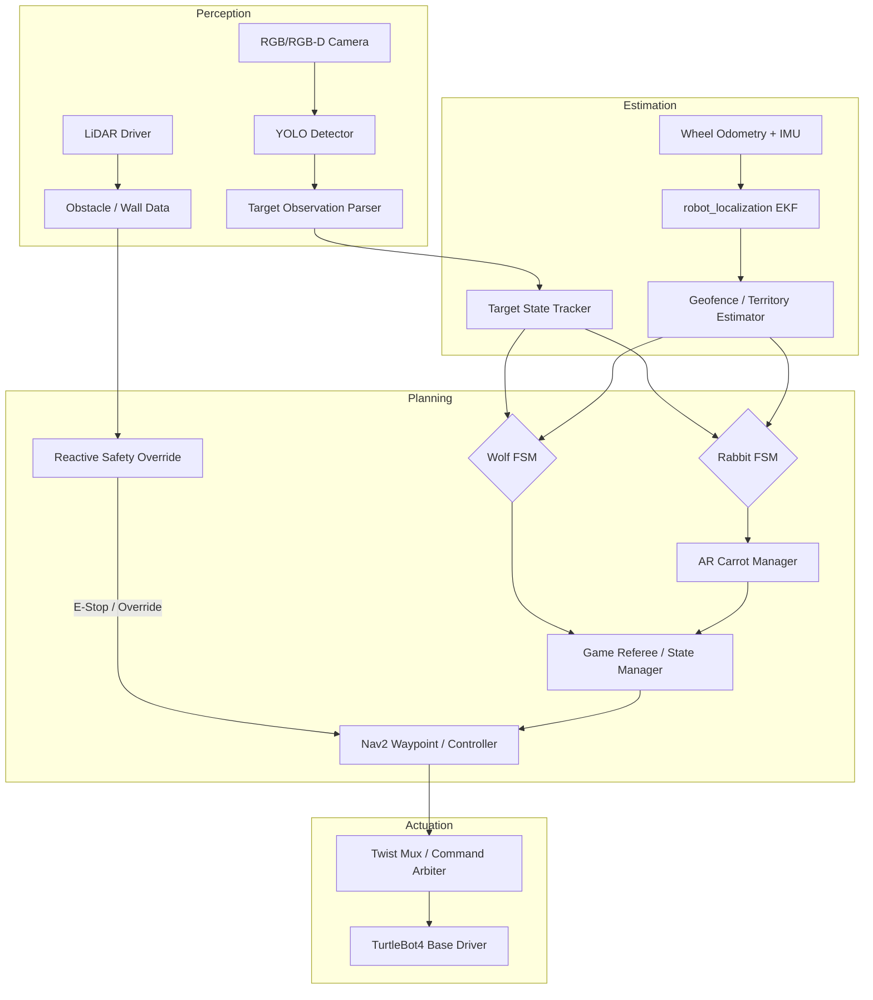

# **Milestone 1**
---
## **1. Mission Statement & Scope** 
This project develops a two-robot predator-prey game using TurtleBot4 in a bounded indoor arena. One robot acts as the wolf and patrols only within its designated territory, while the other acts as the rabbit and searches the larger arena for randomly generated AR carrots. Both robots use YOLO-based visual detection to recognize physical image markers mounted on top of the wolf and rabbit, as well as the carrot targets.

When the rabbit detects the wolf, it immediately turns 180 degrees and escapes. If it reaches the edge of the wolf's territory, it changes direction and continues fleeing until it exits the territory. The wolf patrols within its territory and chases the rabbit when detected, but stops at the boundary if the rabbit escapes. The game ends when the wolf gets within 0.4 meters of the rabbit.

## **2. Technical Specifications**
- **Robot Platform:** 2 × TurtleBot4 (Robot A: Rabbit, Robot B: Wolf)
- **Kinematic Model:** Differential Drive
- **Perception Stack:**
  - RGB / RGB-D Camera — YOLO-based detection of wolf marker, rabbit marker, and AR carrots
  - 2D LiDAR — obstacle detection, wall avoidance, and safety override
  - IMU — heading stabilization and turn control
  - Wheel Odometry — local motion estimation
  - `robot_localization` EKF — fuses odometry and IMU for smooth state estimation

## **3. High-Level System Architecture**

### **Mermaid Diagram**

The diagram below shows the full perception → estimation → planning → actuation pipeline for both robots, including the reactive safety bypass.

### **Flowchart: Robot Behavior Overview**

The following flowcharts describe the high-level behavioral logic for each robot independently.

**Robot A — Rabbit (Food-Finding Area):**

Starting from idle, the rabbit roams randomly within the global arena searching for carrots. Upon finding a carrot it navigates to it and consumes it (with a 30-second cooldown before the next spawn). After eating, it checks for the wolf. If the wolf is spotted, it runs away. If the wolf catches the rabbit before it escapes, the game ends.

**Robot B — Wolf (Hunting Ground):**

Starting from idle, the wolf spins in place inside its territory scanning for the rabbit. If no rabbit is detected, it continues patrolling. Once the rabbit is detected, it chases. If the wolf catches the rabbit, the game ends; otherwise it returns to patrol with a 30-second cooldown.

### **Module Declaration Table**

| Module / Node | Functional Domain | Software Type | Description |
|---|---|---|---|
| RGB / RGB-D Camera Driver | Perception | Library | Captures camera frames for YOLO-based object detection. |
| LiDAR Driver | Perception | Library | Provides obstacle and wall distance data for safety and boundary handling. |
| YOLO Detector | Perception | Custom Integration | Detects wolf marker, rabbit marker, and AR carrot from camera images. |
| Target Observation Parser | Perception | Custom | Converts YOLO outputs into labeled observations with confidence, direction, and approximate range. |
| `robot_localization` EKF | Estimation | Library | Fuses odometry and IMU into a stable 2D robot pose estimate. |
| Geofence / Territory Estimator | Estimation | Custom | Determines whether each robot is inside the global arena, wolf territory, or near a boundary. |
| Target State Tracker | Estimation | Custom | Tracks visible state and relative location of the wolf, rabbit, and AR carrot. |
| Rabbit Behavior FSM | Planning | Custom | Controls carrot search, roaming, wolf avoidance, escape motion, and boundary handling. |
| Wolf Behavior FSM | Planning | Custom | Controls territorial patrol, target pursuit, and chase termination at the boundary. |
| AR Carrot Manager | Planning | Custom | Manages carrot spawn, consumption, and respawn events. |
| Game Referee / State Manager | Planning | Custom | Governs game state, capture conditions, rabbit death, and reset logic. |
| Reactive Safety Override | Planning | Custom | Overrides normal motion when collision, timeout, or geofence risk is detected. |
| Nav2 Waypoint / Controller | Actuation | Library | Converts high-level goals into smooth velocity commands. |
| Twist Mux / Command Arbiter | Actuation | Library | Merges normal navigation commands with emergency and safety commands. |
| TurtleBot4 Base Driver | Actuation | Library | Sends velocity commands to the physical robot base. |

### **Module Intent**

#### **Library Modules**

**`robot_localization` EKF**
We will use the `robot_localization` package to provide stable 2D pose estimation for both robots. Because the wolf and rabbit need reliable heading and position estimates during fast turning, patrol, and escape maneuvers, pure wheel odometry alone is insufficient. The EKF will fuse wheel odometry with IMU data to reduce drift and improve heading consistency — especially during sudden rotations such as the rabbit's 180-degree escape. We intend to configure the filter in 2D mode and tune sensor covariance matrices, update frequency, and process noise to produce smooth motion estimates suitable for territory checking, chase transitions, and waypoint navigation.

**Nav2 Waypoint / Controller**
We will use Nav2 as the main motion execution framework for both robots. The custom behavior FSMs decide what each robot should do — patrol, escape, chase — while Nav2 handles actual path following and local motion control. This separation reduces implementation complexity and improves robustness. We intend to tune controller frequency, maximum linear and angular velocity, goal tolerance, and recovery behavior so that the wolf reacts quickly during pursuit and the rabbit flees smoothly. Nav2 is selected for its mature ROS 2 tooling, well-tested waypoint following, and clean interface between high-level planning and low-level differential-drive actuation.

**LiDAR Driver**
The LiDAR driver serves as a core safety and environmental awareness component. Even though gameplay interaction relies primarily on YOLO-based visual recognition, LiDAR remains essential for preventing collisions with walls, furniture, or the other robot during aggressive maneuvers. It supports the safety override layer when a robot approaches arena boundaries too closely. We intend to tune the effective range window, obstacle filtering threshold, and minimum stop distance used by the safety layer.

#### **Custom Modules**

**YOLO Detector Integration**
This module integrates a YOLO-based object detection pipeline into the ROS 2 perception stack. It recognizes three key visual classes in real time: the wolf marker, the rabbit marker, and the AR carrot. The wolf and rabbit each carry a physical printed image mounted on top, and the detector classifies these to determine which robot is currently visible. The node will subscribe to camera images, run YOLO inference, and publish filtered detections with labels, confidence values, and bounding box geometry. These outputs feed behavior triggers such as "wolf seen," "rabbit seen," and "carrot found." We expect to tune confidence thresholds, inference rate, NMS settings, and image resolution for stable detection during motion.

**Rabbit Behavior FSM**
The Rabbit Behavior FSM implements the full decision-making logic for the rabbit. Its states include: roaming, carrot searching, carrot approaching, carrot consumption, wolf detection, emergency turning, escape, and post-boundary replanning. When the rabbit detects the wolf via YOLO, it immediately interrupts its current task, rotates 180 degrees, and flees in the opposite direction. If it reaches the edge of the wolf's territory before fully escaping, it selects a new safe direction and continues until it exits. This FSM consumes target observations, robot pose, and geofence status, then outputs high-level navigation goals or direct motion commands.

**Wolf Behavior FSM**
The Wolf Behavior FSM controls patrol and pursuit for the wolf. In normal operation, the wolf continuously patrols within its territory using waypoint-based or bounded random roaming. Once the rabbit is detected via YOLO, it transitions into chase mode. Crucially, the wolf must obey a strict territorial rule: it may only chase while the rabbit remains inside the hunting area. If the rabbit escapes the territory, the wolf stops at the boundary, rotates inward, and resumes patrol. The FSM takes target visibility, relative rabbit state, and territory membership as inputs to generate pursuit or patrol goals.

**Geofence / Territory Estimator**
This module enforces the project's spatial rules. It determines whether each robot is inside the global arena, inside the wolf territory, near a boundary, or outside an allowed region. Using the EKF pose estimate compared against predefined geometric boundary definitions (rectangles or polygons), it publishes state flags and margin values. The rabbit uses these to confirm successful escape; the wolf uses them to decide when to terminate a chase. This estimator also supports system-wide safety intervention if a robot approaches an invalid region.

**Game Referee / State Manager**
The Game Referee manages overall game logic. It tracks whether the system is in idle, active search, chase, escape, captured, or reset mode, and checks the distance between the wolf and rabbit. When that distance drops to 0.4 meters or below, it declares the rabbit captured and ends the round. It also coordinates AR carrot spawning, removal after consumption, and cooldown timing before the next round. Without this module, each robot might make locally correct decisions but fail to produce a coherent game sequence.

---

## **4. Safety & Operational Protocol**

### **Deadman Switch Logic**

To prevent uncontrolled motion or hardware damage, both robots implement software-level deadman and timeout protection.

**Command Timeout**
If a robot does not receive a valid motion command for more than 0.5 seconds, it will automatically publish zero velocity and enter a paused state.

**Sensor Timeout**
If camera, LiDAR, or localization updates are missing for more than 1.0 second, the robot will disable chase and escape behavior and fall back to stop mode or low-speed recovery mode.

**Localization Failure**
If the EKF output becomes invalid, unstable, or unavailable, the robot will stop autonomous navigation immediately.

### **System-Wide E-Stop Conditions**

A global E-stop will be triggered if any of the following occurs:

- A robot is about to leave the global arena
- The wolf is about to leave its territory
- LiDAR reports an obstacle within the hard safety threshold
- Critical perception or localization topics time out
- A control node crashes or stops responding
- Manual emergency stop is pressed
- Capture condition is satisfied and the game must freeze immediately

### **Post-Capture Protocol**

When the wolf reaches within 0.4 m of the rabbit:

1. The referee declares the rabbit captured
2. Both robots stop moving
3. Carrot spawn and active game logic are frozen
4. The system enters an end state or cooldown before reset

### **Operational Safety Notes**

Because this project involves two autonomous mobile robots in a shared physical space, all testing should begin at low speed with reduced chase aggressiveness and a clear manual intervention method available. During initial experiments, robots should be tested with soft geofence margins and a larger capture threshold before switching to final gameplay settings.

---

## **5. Git Infrastructure**

...

