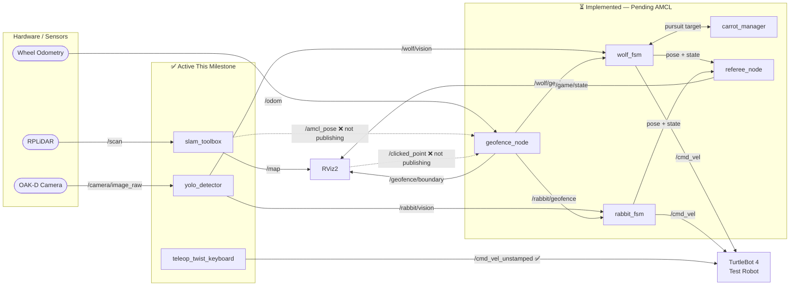
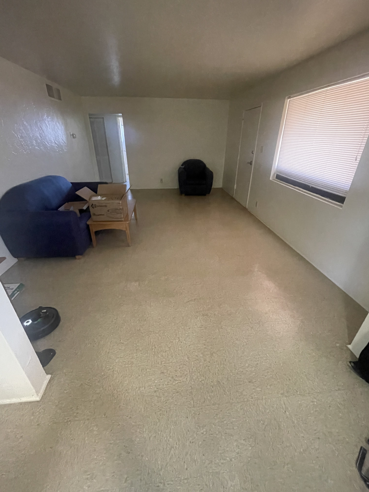
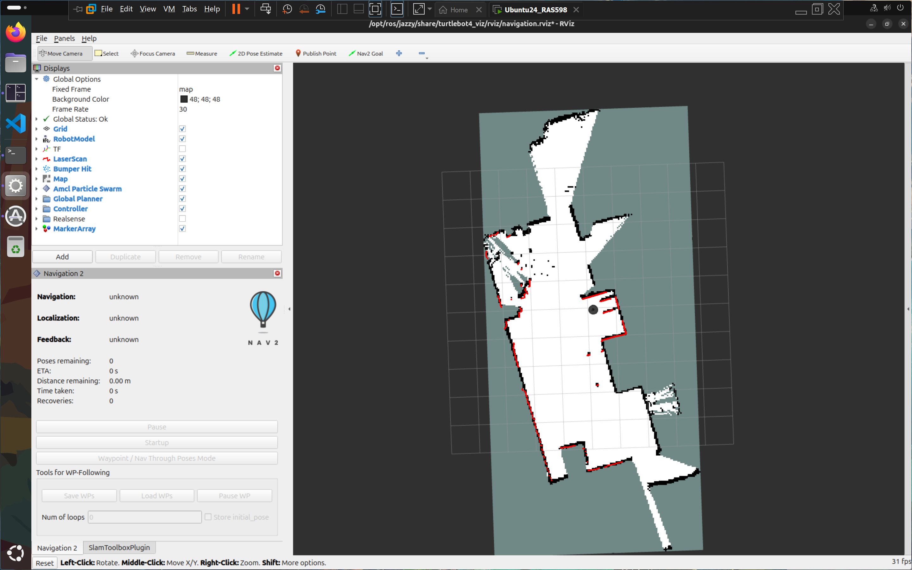

# **Milestone 2**

---

## **1. Kinematics**

The TurtleBot 4 follows a **differential drive** kinematic model,
mapping wheel velocities $(v_r, v_l)$ to state updates $(x, y, \theta)$:

$$v = \frac{v_r + v_l}{2}, \quad \omega = \frac{v_r - v_l}{L}$$

$$\dot{x} = v\cos\theta, \quad \dot{y} = v\sin\theta, \quad \dot{\theta} = \omega$$

Two robots are deployed with different velocity profiles:
- **Robot 1, The Rabbit (Slow):** $v_r, v_l \leq v_{max,1}$
- **Robot 2, The Wolf (Fast):** $v_r, v_l \leq v_{max,2}$

where $L = 0.235$ m is the wheelbase of the TurtleBot 4.

---

## **2. System Architecture**

### **I. Detailed Computational Map**

#### Topics:

| Topic | Direction | Type | Description |
|---|---|---|---|
| `/geofence/boundary` | Published | `visualization_msgs/MarkerArray` | Color-coded polygon boundary published by `geofence_node` for RViz visualization (green = SAFE, orange = WARNING, red = BREACH) |
| `/rabbit/cmd_vel` | Published | `geometry_msgs/Twist` | Velocity commands to the Rabbit robot's Create 3 base |
| `/wolf/cmd_vel` | Published | `geometry_msgs/Twist` | Velocity commands to the Wolf robot's Create 3 base |
| `/cmd_vel_unstamped` | Published | `geometry_msgs/Twist` | Direct velocity commands used during teleoperation (hardware alias) |
| `/rabbit/odom` | Subscribed | `nav_msgs/Odometry` | Wheel odometry for the Rabbit robot |
| `/wolf/odom` | Subscribed | `nav_msgs/Odometry` | Wheel odometry for the Wolf robot |
| `/camera/image_raw` | Subscribed | `sensor_msgs/Image` | RGB camera feed from the OAK-D camera, consumed by the YOLO detector |
| `/rabbit/vision` | Published | `std_msgs/String` | YOLO detection output scoped to the Rabbit robot (detected class + confidence) |
| `/wolf/vision` | Published | `std_msgs/String` | YOLO detection output scoped to the Wolf robot (detected class + confidence) |
| `/rabbit/geofence` | Published | `std_msgs/Bool` | Boundary violation flag for the Rabbit robot |
| `/wolf/geofence` | Published | `std_msgs/Bool` | Boundary violation flag for the Wolf robot |
| `/game/state` | Published | `std_msgs/String` | Game state broadcast from `referee_node` (e.g. `RUNNING`, `WOLF_WINS`, `RABBIT_ESCAPES`) |
| `/scan` | Subscribed | `sensor_msgs/LaserScan` | 2D LiDAR data used for SLAM mapping and obstacle awareness |
| `/map` | Published | `nav_msgs/OccupancyGrid` | Occupancy grid generated by SLAM Toolbox |
| `/amcl_pose` | Subscribed | `geometry_msgs/PoseWithCovarianceStamped` | Localized pose estimate from AMCL — *not yet operational, see Section 3* |
| `/clicked_point` | Subscribed | `geometry_msgs/PointStamped` | RViz geofence boundary definition points — *not yet operational, see Section 3* |

#### Services / Actions:

| Service / Action | Type | Description |
|---|---|---|
| `slam_toolbox/save_map` | Service (`nav2_msgs/SaveMap`) | Triggered to serialize and save the generated occupancy map to disk |
| `slam_toolbox/serialize_map` | Service | Saves the internal SLAM graph for later localization |



---

### **II. Module Descriptions**

This milestone focused on establishing the physical hardware communication pipeline before higher-level modules could be tested. The core modules developed so far are:

**`yolo_detector.py`** — Subscribes to the OAK-D camera topic and runs a trained YOLOv8 model to detect and classify the identification signs mounted on each robot. Outputs bounding boxes and class labels used to distinguish the Wolf from the Rabbit at runtime.

**`wolf_fsm.py`** — Implements the FSM governing the Wolf robot's behavior. States include `PATROL`, `CHASE`, and `BOUNDARY_STOP`. Subscribes to `/wolf/vision` for perception events and `/wolf/geofence` for boundary violations. Publishes to `/wolf/cmd_vel`.

**`rabbit_fsm.py`** — Implements the FSM governing the Rabbit robot's behavior. States include `SEARCH`, `FLEE`, and `BOUNDARY_TURN`. On detecting the Wolf via `/rabbit/vision`, the Rabbit executes a 180° turn and flees. Publishes to `/rabbit/cmd_vel`.

**`geofence_node.py`** — A full geofencing engine implementing a three-state control machine: `SAFE`, `WARNING`, and `BREACH`. Subscribes to `/amcl_pose` using a `TRANSIENT_LOCAL / RELIABLE` QoS profile to match AMCL's publisher. The zone boundary is defined as an arbitrary polygon (minimum 3 vertices) in the map frame, loaded from `geofence_params.yaml`. Position is tested using a ray-casting point-in-polygon algorithm. Boundary proximity is computed via closest-point-on-segment across all edges, with inward normals derived geometrically and verified against the polygon centroid. In `WARNING` state (within 0.5 m of boundary), corrective velocity is applied with a quadratic fade proportional to proximity. In `BREACH` state (outside polygon), full velocity override drives the robot back inward. In `SAFE` state, the node stays silent and Nav2 drives normally. Publishes a color-coded `MarkerArray` to `/geofence/boundary` for RViz visualization (green / orange / red by state).

**`carrot_manager.py`** — Implements a carrot-chasing pursuit strategy for the Wolf. Given the Rabbit's last known position, computes intermediate waypoints that drive the Wolf toward the target while respecting geofence constraints.

**`referee_node.py`** — Arbitrates game state. Subscribes to both robots' poses and geofence events, evaluates capture conditions (Wolf within 0.4 m of Rabbit), and publishes game outcome to `/game/state`.

> **Note:** `geofence_node.py`, `carrot_manager.py`, `rabbit_fsm.py`, and `referee_node.py` are implemented but could not be tested end-to-end this milestone due to unresolved `/amcl_pose` and `/clicked_point` issues (see Section 3.II). End-to-end integration testing is the primary goal for Milestone 3.

---

## **3. Experimental Analysis**

### **I. Noise & Uncertainty Analysis**

#### Hardware:

Hardware integration consumed the majority of this milestone's effort. The following observations were made during physical robot operation:

**LiDAR (`/scan`):** Once the ROS 2 communication pipeline was established, LiDAR data streamed reliably into RViz. Scan quality was visually consistent with expected room geometry. No significant noise artifacts were observed during the indoor mapping session, which is expected given the structured environment (living room walls, furniture).

**SLAM Map Quality:** A map of the test environment was successfully generated and saved using SLAM Toolbox following the [TurtleBot 4 mapping tutorial](https://turtlebot.github.io/turtlebot4-user-manual/tutorials/generate_map.html). The map captured room boundaries clearly. Some minor drift artifacts appeared at corners, consistent with expected odometric error accumulation over longer traversals — a known characteristic of wheel-encoder-based odometry on carpeted surfaces.


Living Room 

Mapped Living Room

**Teleop Latency:** After establishing the DDS discovery pipeline (see Section 3.II), teleoperation via `teleop_twist_keyboard` on the `/cmd_vel_unstamped` topic was responsive with no perceptible lag. This confirms the Fast DDS discovery server is functioning correctly for real-time command throughput.

**YOLO Perception — Marker Detection:**

A key perception milestone was achieved independently this sprint. Starting from just **two source images** — one stock photograph of a wolf and one of a rabbit — a custom YOLO detection model was trained that can reliably distinguish and label each robot's identification marker in real time.

The core challenge the professor flagged in his feedback was angle robustness: a flat printed image mounted on a robot will be viewed from different distances, rotations, and perspective angles during gameplay. To address this, an aggressive offline augmentation pipeline (`generate_sign_dataset.py`) was built to synthetically expand the two source images into a full training dataset. Augmentations applied include:

- **In-plane rotation** (0°–360°)
- **Horizontal and vertical flipping**
- **Perspective warping** — simulating the image being tilted toward or away from the camera (z-axis flip / page-turn effect)
- **Brightness and contrast jitter**
- **Gaussian blur and noise**

The resulting model (`yolov8n.pt` / `yolo11n.pt`) was validated to correctly label the wolf marker as `wolf` and the rabbit marker as `rabbit` across a wide range of viewing angles, including near-perpendicular perspectives where the image is significantly foreshortened. It does not generalize to other objects — detections are tightly scoped to these two specific markers only, which is the desired behavior for this application.

**Physical marker design:** The printed images will be arranged in a triangular or square prism configuration and mounted vertically on each robot, ensuring at least one face is always visible to the opposing robot's camera regardless of relative orientation.

#### Simulation:

Full simulation testing was deprioritized this milestone in favor of resolving the hardware connectivity issues that were blocking all physical robot work. Simulation will be used in Milestone 3 as a parallel testing environment for the behavior modules once `/amcl_pose` localization is confirmed working on hardware.

---

### **II. Run-Time Issues**

This milestone encountered a significant cascade of hardware and networking failures. Each issue is documented below with the root cause identified and the resolution applied.

---

**Issue 1: TurtleBot 4 failed to broadcast AP WiFi signal**

After following the course setup guide (removing the `wifis:` block from `50-cloud-init.yaml` to force AP mode), the robot powered on but did not broadcast the expected `Turtlebot4` SSID. Connecting via Ethernet as a fallback also failed. The issue was escalated to the instructor, who resolved it directly on the hardware — the root cause could not be definitively identified, suggesting a firmware or SD card write anomaly.

*Resolution:* Instructor-assisted hardware fix. No software-side workaround was applicable.

---

**Issue 2: VPN blocking ping to TurtleBot gateway**

After the robot was repaired and broadcasting AP WiFi, USB tethering was used to share internet to the laptop while simultaneously connecting to the `Turtlebot4` network. The TurtleBot's default gateway `10.42.0.1` was visible in Windows routing tables but SSH connections and pings failed silently. Extensive troubleshooting of VMware network adapter settings was performed without success over several hours. The next day, the active VPN client was identified as the culprit — it was intercepting and dropping traffic to the `10.42.0.1` subnet.

*Resolution:* Disabling the VPN restored full connectivity. SSH into `ubuntu@10.42.0.1` succeeded immediately.

---

**Issue 3: VMware not routing traffic to TurtleBot**

Even after VPN was disabled, the Ubuntu VM running in VMware could not reach the robot. `ping 10.42.0.1` from inside the VM failed. Windows host could ping successfully.

*Resolution:* In VMware's network adapter settings, the VM was configured to bind exclusively to the Mediatek WiFi adapter (the adapter connected to the `Turtlebot4` SSID) rather than allowing VMware to auto-select adapters. After this change, the VM could ping and SSH into the robot.

---

**Issue 4: ROS 2 topics not visible on the Ubuntu VM**

With SSH working, `ros2 topic list` in the SSH terminal (on the robot) showed all expected topics. However, running `ros2 topic list` on the Ubuntu VM returned only `/parameter_events` and `/rosout` — the robot's topics were invisible across the network. Changing `ROS_DOMAIN_ID` and other DDS settings did not resolve the issue.

*Resolution:* A teammate from another team shared a `setup.sh` script that configured the VM as a **ROS 2 Super Client** pointed at the robot's Fast DDS Discovery Server:

```bash
export ROS_DOMAIN_ID=0
export RMW_IMPLEMENTATION=rmw_fastrtps_cpp
export ROS_DISCOVERY_SERVER=192.168.186.3:11811
export ROS_SUPER_CLIENT=True
```

After sourcing this script and running `ros2 daemon stop && ros2 daemon start`, the full topic list appeared on the VM. Teleoperation and sensor data streaming were confirmed working.

---

**Issue 5: `/amcl_pose` not publishing — geofence node blocked**

After mapping was complete, the geofence node was launched. It subscribes to `/amcl_pose` with a `TRANSIENT_LOCAL / RELIABLE` QoS profile (required to match AMCL's publisher) and runs a 10 Hz control loop that only activates once a pose is received. The topic remained silent — `ros2 topic echo /amcl_pose` returned nothing.

The likely cause is that the localization stack was never properly brought up with the saved map. The correct startup sequence requires:

```bash
ros2 launch turtlebot4_navigation localization.launch.py map:=your_map.yaml
ros2 launch turtlebot4_navigation nav2.launch.py
```

This was not completed in time during the session. Until AMCL is publishing, `self.pose_received` stays `False` inside the node and the control loop returns immediately — so the geofence node is functional but silently idle.

*Status: Unresolved.* Fixing the localization bringup sequence is the top priority for the next hardware session.

---

**Issue 6: `/clicked_point` not publishing from RViz**

The geofence workflow requires using RViz's "Publish Point" tool to click polygon vertices on the map, with coordinates echoed from `/clicked_point` and then copied into `geofence_params.yaml`. Despite correctly adding the tool via *Panels → Tool Properties → Add → Publish Point* and clicking on the map, `ros2 topic echo /clicked_point` returned no output.

*Status: Partially resolved.* A set of polygon coordinates was obtained through a separate session and hardcoded directly into `geofence_params.yaml` (vertices at approximately `(0.689, 2.39)`, `(-3.58, 1.51)`, `(-3.32, 0.159)`, `(0.202, 0.899)` in the map frame). The RViz tool issue is suspected to be a fixed-frame mismatch — if the RViz fixed frame is not set to `map`, clicked points are computed in an incorrect frame and silently dropped. This will be confirmed in the next session once AMCL localization is running.

---

### **III. Milestone Video**

> 📹 **Video coming — record and link here before submission.**  
> Even a short phone recording of RViz showing the map + teleoperation is sufficient. Upload to YouTube (unlisted) and embed the link below.


---

## **4. Project Management**

### **I. Instructor Feedback Integration**

| Critiques/Questions | Technical Actions |
|---------------------|-------------------|
| **Feedback** <br> Good write-up! Love the wolf and rabbit pics! This is a really cool multi-robot project, the only one in the class. Excited to see the final demo! | We appreciate the kind feedback and are motivated to deliver a strong final demo! |
| **Fixes** <br> 1. Math equations are not rendered correctly. <br> 2. Missing Mermaid block diagram, module declaration table, and module intent for library nodes. | 1. MathJax rendering has been corrected via the `math: mathjax` front matter flag. <br> 2. Module descriptions and the computational map table are now included in Section 2 of this milestone. A Mermaid architecture diagram will be added in Milestone 3 once all nodes are confirmed operational. |
| **Project Idea Feedback** <br> 1. Since handling three robots is going to be difficult (access, battery issues, hardware failures), I would suggest starting with two; once that works, throw the third one into the mix. <br><br> 2. Are you planning to differentiate each robot using pictures or a 3D model atop the robots? Pictures might complicate things when viewed at an angle, while 3D models might lack enough features for reliable detection. | 1. Agreed — our team has officially scoped down to two robots (Wolf and Rabbit) for this milestone and Milestone 3. We will revisit a third robot only if time permits after the two-robot system is fully validated. <br><br> 2. We trained a custom YOLO model using an augmentation-only pipeline — starting from just two source images and synthetically generating a full dataset with perspective warps, rotations, flips, and noise. The trained model successfully detects and distinguishes the wolf and rabbit markers across a wide range of viewing angles, including near-perpendicular perspectives. Physical markers will be mounted in a triangular or square prism configuration so at least one face is always camera-visible. See Section 3.I for full details. |

---

### **II. Individual Contribution**

| Team Member | Primary Technical Role | Key Git Commits/PRs | Specific File(s) Authorship |
|:-----------:|:----------------------:|:-------------------:|:---------------------------:|
| Aldrick | Hardware Integration & Networking | [`75035d5`](https://github.com/abc-mobile-robotics/abc-mobile-robotics.github.io/commit/75035d5) | [`turtlebot4_geofence`](https://github.com/abc-mobile-robotics/abc-mobile-robotics.github.io/tree/main/project/code/turtlebot4_geofence) [`maps`](https://github.com/abc-mobile-robotics/abc-mobile-robotics.github.io/tree/main/project/code/turtlebot4_geofence)|
| Brian | Perception (YOLO) | [`e2a6249`](https://github.com/abc-mobile-robotics/abc-mobile-robotics.github.io/commit/e2a6249) | [`wolf_rabbit_yolo`](https://github.com/abc-mobile-robotics/abc-mobile-robotics.github.io/tree/main/wolf_rabbit_yolo), [`wolf_rabbit_game`](https://github.com/abc-mobile-robotics/abc-mobile-robotics.github.io/tree/main/project/code/wolf_rabbit_game)|
| Chach | Hardware Setup and Troubleshooting | [`eab7cd7`](https://github.com/abc-mobile-robotics/abc-mobile-robotics.github.io/commit/eab7cd7e7) | [`setup.sh`](https://github.com/abc-mobile-robotics/abc-mobile-robotics.github.io/blob/main/project/code/startup.sh) |
