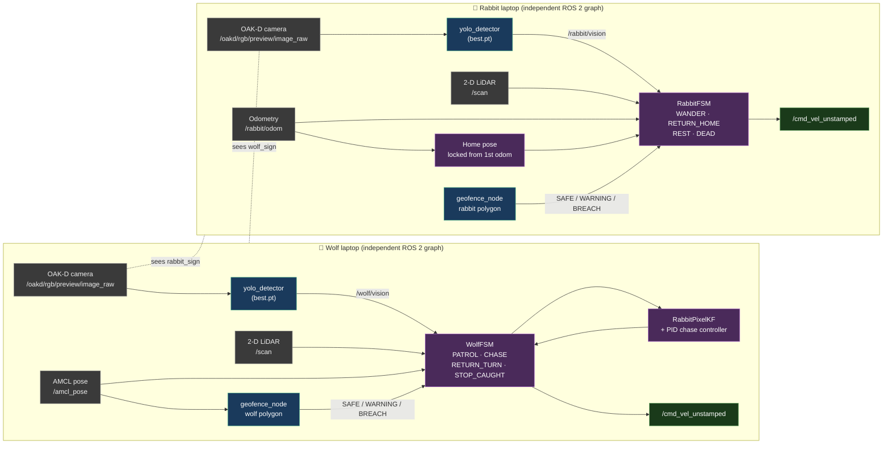

# **Milestone 3**
---
## **1. Graphical Abstract**
---
Cross-robot ROS 2 networking was not feasible in our setup, so the system runs as **two fully independent stacks** — one laptop per robot. Each laptop runs its own `yolo_detector`, its own `geofence_node`, and its own FSM, all driving a single TurtleBot4 over `/cmd_vel_unstamped`. Nothing is shared at runtime: the wolf has no idea where the rabbit is in map coordinates, only what its own camera and LiDAR see, and vice versa. The "catch" event is detected locally by the wolf using the rabbit's bounding-box width, and the operator terminates both programs when `STOP_CAUGHT` is reached.

The diagram below shows the two parallel pipelines and highlights that the only coupling between them is physical — the cameras observing each other in the shared arena.



The dotted lines between the two subgraphs are the only "communication channel" — each robot's camera physically observing the other one in the arena. There is no ROS 2 message that crosses laptops.

## Demonstration Video

The following video demonstrates the complete wolf-rabbit robot system operating in the game environment. In the demo, the robot uses the YOLO vision module to detect the rabbit sign, wolf sign, and carrot, while the geofence module monitors whether the robot remains inside the allowed arena and territory boundaries. The video shows how perception, boundary checking, and robot behavior are integrated to support autonomous gameplay.

---
## **2. Algorithm**
---

Each laptop runs four nodes (perception, geofence, FSM, optional tuner). The two stacks are functionally identical in shape but parameterized for their respective robots; the wolf stack additionally runs a Kalman-filter-based chase controller that the rabbit stack does not need.
>>>>>>> e89cf03453ca82ac97853832824dc4ca49868707

### 2.1 Perception — `yolo_detector` (one instance per laptop)

Each laptop runs its own copy of the YOLO node, loading the same `best.pt` weights but only consuming its own camera stream:

- For every incoming `sensor_msgs/Image`, the frame is converted with `cv_bridge` and passed to an Ultralytics YOLO model trained on three classes: `wolf_sign`, `rabbit_sign`, and `carrot`.
- Detections are filtered by `confidence_threshold` (default 0.5) and reduced to the highest-confidence box per class.
- The node still publishes both `/wolf/vision` and `/rabbit/vision` payloads (the code is symmetric and was originally written for the cross-robot version), but only the topic relevant to that laptop's FSM is actually consumed. Each payload contains `*_visible`, `*_confidence`, `*_center_x`, `*_bbox_width`, plus `image_width` and `stamp`.
- The actual frame width is written into every payload at runtime so downstream consumers can normalize pixel error correctly even if the camera resolution differs from the launch parameter.

### 2.2 Wolf decision — `WolfFSM`

Runs at 50 Hz on the wolf laptop. Top-level state set: `{PATROL, CHASE, RETURN_TURN, STOP_CAUGHT, STOP}`. Transition priorities each tick:

1. If `rabbit_alive == False` → `STOP`.
2. If catch is confirmed (rabbit bounding-box width ≥ `catch_bbox_width_px` for `catch_confirm_frames` consecutive frames, with cooldown) → `STOP_CAUGHT` for `catch_pause_sec`, then back to `PATROL`.
3. If geofence reports `BREACH` while in `CHASE` → abort to `RETURN_TURN`.
4. If rabbit is visible and fresh on `/wolf/vision` → `CHASE`.
5. Otherwise stay in `PATROL`.

Note that conditions like `inside_wolf_territory` and `rabbit_escaped` are read from the wolf's own `rabbit_geofence` topic, which on this laptop is **not** populated by the rabbit's actual position (no cross-robot link) — it defaults to "rabbit is inside" and the wolf relies entirely on its own vision and its own geofence to make decisions.

**Patrol sub-state machine** (driven by the same 50 Hz loop):

```
FORWARD ── obstacle in forward cone ──► TURNING (timed, randomized direction)
   │                                        │
   │                                        ▼
   │                                   FORCE_FORWARD ──► FORWARD
   │
   └── straight duration expired ───► SCANNING (closed-loop spin to random yaw) ──► FORWARD

WARNING (geofence) ── continuous P-controller toward polygon centroid, slowed down
BREACH  (geofence) ── BREACH_ALIGN (spin to centroid yaw) ──► BREACH_DRIVE (drive until SAFE/WARNING)
```

Forward-cone obstacle distance is computed by `_sector_min(scan, -30°, +30°)`. Both `BREACH_ALIGN` and the warning response use the polygon centroid computed once at startup and AMCL pose for accurate map-frame yaw error.

**Chase controller.** Pixel error is normalized to `[-1.5, 1.5]` using the live `image_width`, fed through a PID with derivative low-pass filter:
$$\omega = -\,\mathrm{clamp}\!\left(K_p\, e + K_i \int e\,dt + K_d\, \dot{e}_{\mathrm{filt}},\ -\omega_{\max},\ \omega_{\max}\right)$$
A 1-D constant-velocity Kalman filter on the rabbit's pixel x-position smooths YOLO jitter and provides a feed-forward look-ahead `px + vx · t_lookahead`. The filter's predict step compensates for the wolf's own rotation:
$$p_x \leftarrow p_x + v_x\,\Delta t - \omega_{\mathrm{cmd}}\,\Delta t\,\rho_{\mathrm{px/rad}}$$
Linear speed is scaled down proportionally to `|ω|/ω_max` so the wolf slows in tight turns, and again by `chase_warning_speed_scale` when the geofence reports `WARNING`.

### 2.3 Rabbit decision — `RabbitFSM`

Runs at 20 Hz on the rabbit laptop. State set: `{WANDER, RETURN_HOME, REST, DEAD}`. Home is **not** read from a parameter or topic — it is locked from the first odometry sample, so the rabbit treats wherever it was started as its safe zone. This is especially convenient given the two-laptop setup, because there is no shared map frame to anchor home to.

Transition priorities each tick:

1. If `rabbit_alive == False` or game phase is `CAPTURED` → `DEAD` (stop and hold).
2. Energy drains while active (`wander_energy_drain_per_sec`, `return_energy_drain_per_sec`); on depletion → `REST` until energy ≥ `rest_resume_energy`.
3. If wolf is visible on `/rabbit/vision` and rabbit is outside its safe radius → `RETURN_HOME`.
4. If wolf is visible and rabbit is already in safe zone → stop in place (hide).
5. Otherwise → `WANDER` near home with random straight legs, scanning, and LiDAR-based obstacle turns.

**Wander sub-states** mirror the wolf's pattern (`FORWARD → SCANNING → FORWARD`, with `TURNING` triggered by the forward-cone safety distance), but the rabbit additionally checks `distance_to_home`: if it drifts beyond `wander_radius` it drives back toward home rather than continuing outward.

**Return-home controller.** Heading is computed from current odometry to the locked home pose:
$$\theta_{\mathrm{tgt}} = \mathrm{atan2}(y_h - y,\ x_h - x), \quad \omega = \mathrm{clamp}(K_\theta\,\mathrm{wrap}(\theta_{\mathrm{tgt}}-\theta),\ -\omega_{\max},\ \omega_{\max})$$
Forward speed is gated: while $|\theta_{\mathrm{err}}| >$ `return_yaw_drive_threshold` the rabbit only rotates; once aligned it drives forward, scaled by $1 - 0.45\,|\omega|/\omega_{\max}$ so heavy turns slow it down.

### 2.4 Geofence supervisor — `geofence_node` (one instance per laptop)

Each laptop runs its own copy. The node is written to handle two independent polygons (wolf and rabbit), but on each laptop only the polygon for that robot is meaningful — the other zone simply never gets a pose update because the corresponding pose topic only exists on the other laptop. Per zone, every 10 Hz tick:

- **Inside test:** ray-casting `point_in_polygon`.
- **Distance to boundary:** minimum distance from the point to each edge segment via projection onto each edge.
- **Classification:** `BREACH` if outside; `WARNING` if inside and within `warning_distance` of any edge; `SAFE` otherwise.

Each zone publishes a plain-string status (consumed directly by the FSM) and a verbose `key=value` detail string (consumed by the wolf's `wolf_geofence_detail_callback` to read `dist=` for smarter recovery). RViz `MarkerArray` boundary visualizations are also published — useful when watching the wolf laptop's RViz session live during runs.

### 2.5 Tuner — `wolf_tuner.py`

Runs on the wolf laptop only. A Tk GUI that connects to `/wolf_fsm` via the standard ROS 2 parameter services (`SetParameters` / `GetParameters`) for live tuning of PID gains, KF parameters, and speed limits. A mirrored `_DisplayKF` runs in the GUI process so the live gauge can show both the raw YOLO measurement (dim dot) and the filtered + look-ahead estimate (bright bar) in real time. Because the tuner uses the local ROS 2 parameter service, it works fine even though the two laptops are not networked.

---
## **3. Benchmarking & Results**
---

Because the two stacks are independent and the catch event is recognized locally by the wolf using the rabbit's bounding-box width as a proxy for proximity, the operator terminates both programs when `STOP_CAUGHT` is reached. The metrics below are designed around that constraint and are reported here as **placeholders** to be filled in after the final test runs.

### 3.1 Perception accuracy (YOLO)

Measured on a held-out validation set of camera frames recorded from `/oakd/rgb/preview/image_raw` during the runs. Because each laptop runs its own YOLO instance on its own camera, accuracy is reported per-robot.

| Class         | Robot  | Precision | Recall | mAP@0.5 | Frames evaluated |
|:-------------:|:------:|:---------:|:------:|:-------:|:----------------:|
| `rabbit_sign` | wolf   |    TBD    |  TBD   |   TBD   |       TBD        |
| `wolf_sign`   | rabbit |    TBD    |  TBD   |   TBD   |       TBD        |
| `carrot`      | both   |    TBD    |  TBD   |   TBD   |       TBD        |

Suggested protocol: log every published `/wolf/vision` and `/rabbit/vision` message together with the corresponding raw frame on each laptop, hand-label a random sample of N ≥ 200 frames per class per laptop, and compute precision/recall against `confidence_threshold = 0.5`.

### 3.2 Tracking error (Kalman filter on rabbit pixel x — wolf laptop only)

Reported during `CHASE` only.

| Metric                                          | Value | Notes                                      |
|:------------------------------------------------|:-----:|:-------------------------------------------|
| Mean abs. normalized error \|e\| (KF + look-ahead) |  TBD  | Normalized by half image width             |
| Mean abs. normalized error \|e\| (raw YOLO)        |  TBD  | Same normalization, no filter              |
| Frames in deadband (\|e\| < `chase_deadband`)      |  TBD  | Higher = better aim                        |
| Lost-frame events (≥ `chase_lost_frames` stale)  |  TBD  | Each event drops `CHASE → PATROL`          |

Suggested protocol: log `kf_px`, `kf_vx`, predicted px, raw `rabbit_center_x`, and `chase_deadband` at every chase tick; reduce offline.

### 3.3 Behavior-level success

Run N ≥ 10 trials. A trial starts with both robots in their starting poses and ends when either the wolf catches the rabbit (operator kills both processes), the rabbit times out as "survived," or the operator aborts.

| Metric                              | Value |
|:------------------------------------|:-----:|
| Catch success rate                  |  TBD  |
| Mean time-to-catch (catch trials)   |  TBD  |
| Geofence breach events per trial — wolf |  TBD  |
| Geofence breach events per trial — rabbit |  TBD  |
| Successful breach recoveries (closed-loop `BREACH_ALIGN → BREACH_DRIVE`) |  TBD  |
| Mean rabbit `REST` events per trial |  TBD  |

### 3.4 Error analysis

To be completed after data collection. Expected failure modes worth flagging:

- **YOLO false negatives during fast wolf turns.** The Kalman filter mitigates short dropouts, but if YOLO misses ≥ `chase_lost_frames` consecutive frames the wolf falls back to `PATROL`. Worth logging which sub-state the chase ended in.
- **`kf_pixels_per_rad` mis-calibration.** Drives the feed-forward term in the predict step; if it is too large, the KF over-anticipates rotation and the bright bar lags the raw dot. Recommend re-checking on the live tuner gauge.
- **Geofence polygon mismatch with AMCL drift.** `BREACH_ALIGN` and `BREACH_DRIVE` close the loop on AMCL yaw, so AMCL localization quality directly bounds recovery quality. Each laptop runs its own AMCL on its own map, so localization quality must be verified independently for each robot.
- **Rabbit home-point drift.** Home is locked from the first odometry sample, so any pre-arming wheel slip is baked in. This is intentional (no external dependency, no shared map) but worth documenting per trial.
- **No cross-robot ground truth.** Because the two laptops are not networked, there is no way to log relative pose during a run. All "did the wolf catch the rabbit" judgements are based on the wolf's bounding-box width threshold and operator observation.

---
## **4. Ethical Impact Statement**
---

The goal of this project is to use YOLO and LiDAR to create robot behavior in a simulated wildlife scenario between a rabbit and a wolf. The robot uses YOLO for object detection and LiDAR to measure distance and sense obstacles in its environment. Although this project is based on a simulation, it still raises ethical questions because similar systems could be used in real-world robots in the future. A critical analysis should consider how camera data is handled for privacy, how the robot's movement is controlled for safety, and how limitations in YOLO or LiDAR may create bias in what the robot can or cannot detect.

For privacy, this project should consider how YOLO uses camera data to detect objects in the environment. In the current setup each laptop's OAK-D camera streams every frame from `/oakd/rgb/preview/image_raw` into its local YOLO node, and the only filtering applied is the confidence threshold on detections — the underlying frames themselves are not anonymized. In the simulated rabbit-and-wolf scenario this is low-risk, but in any real-world deployment the same pipeline could incidentally capture people, faces, license plates, or private spaces. To reduce this risk, the system should only collect the data it needs, avoid storing unnecessary images, and blur identifiable details when possible. A practical mitigation is to publish only the bounding-box metadata (which is already what `/wolf/vision` and `/rabbit/vision` carry — `*_visible`, `*_confidence`, `*_center_x`, `*_bbox_width`) and discard the raw frames immediately after inference, rather than logging them by default. The two-laptop setup actually helps here: because nothing is shared between robots, raw frames never leave the laptop that captured them.

For safety, the robot's movement needs to be controlled carefully because it can create physical risks. Even if the robot is small, its speed and mass affect its kinetic energy, meaning a fast-moving robot could damage objects or hurt people, animals, or itself if it crashes. This project addresses that in three concrete ways: (1) every chase command is bounded by `max_angular_speed` and `chase_linear_speed` and is further scaled down in proportion to the commanded angular rate, so the wolf physically cannot accelerate to its top linear speed during a hard turn; (2) both FSMs run a forward-cone LiDAR check (`-30°` to `+30°`, default safety distance 0.45–0.5 m) that interrupts forward motion and triggers a randomized turn before any collision; and (3) each laptop runs its own `geofence_node` that continuously classifies its robot as `SAFE` / `WARNING` / `BREACH` against a map-frame polygon, slowing the wolf down on `WARNING` and forcing a closed-loop return-to-centroid maneuver on `BREACH`. A clear residual risk that comes directly from the two-laptop architecture is that neither robot has any knowledge of the other's pose — the wolf only knows the rabbit is "there" when it can see it on camera, and the rabbit can never proactively flee a wolf it cannot see. The "catch" termination is also operator-triggered rather than automatic: once the wolf enters `STOP_CAUGHT` both programs must be killed manually on both laptops. A future version should make catch-termination automatic across the link and add a hardware emergency stop that bypasses the FSMs entirely.

For bias, the project should consider that YOLO and LiDAR may not detect everything equally well. YOLO depends on the data it was trained on, so the `best.pt` model used here will perform best on the specific `rabbit_sign`, `wolf_sign`, and `carrot` classes it was trained on and may degrade under different lighting, backgrounds, or camera angles than appeared in the training set. Because both laptops load the same weights file, any bias in the training set affects both robots equally. LiDAR can also struggle with certain materials, such as glass or reflective surfaces, which could cause the robot to misunderstand its surroundings — a particular concern given that each FSM's entire obstacle-avoidance behavior is gated on a single forward-cone minimum distance. From a utilitarian view, the system should be designed to create more benefit than harm: the speed/geofence/LiDAR safeguards above already trade some chase performance for collision avoidance, which is the right trade-off. From a justice view, it should work fairly and safely across different environments, not only in ideal testing conditions; in practice this means evaluating the model on out-of-distribution lighting and surfaces before any deployment, and being explicit in the documentation about the conditions under which detection performance was measured.

---
## **5. Custom Module Links**
---

- `wolf_fsm.py` — Wolf finite-state machine (PATROL / CHASE / RETURN_TURN / STOP_CAUGHT) with PID + Kalman-filter chase controller and closed-loop geofence-breach recovery.
- `rabbit_fsm.py` — Rabbit finite-state machine (WANDER / RETURN_HOME / REST / DEAD) with self-locking home pose and energy model.
- `yolo_detector.py` — YOLO inference node (one instance per laptop) publishing local vision payloads on `/wolf/vision` and `/rabbit/vision`.
- `geofence_node.py` — Dual-zone polygon supervisor (one instance per laptop) publishing `SAFE` / `WARNING` / `BREACH` plus a key-value detail string and RViz boundary markers.
- `wolf_tuner.py` — Tk-based live parameter tuner (PID + KF + speed limits) with a real-time gauge that overlays raw YOLO position and the filtered + look-ahead estimate. Wolf laptop only.

> Replace these with your repository links (e.g. `https://github.com/<org>/<repo>/blob/main/wolf_rabbit_game/wolf_fsm.py`) before submission.

---
## **6. Individual Contribution & Audit Appendix**
---

| Team Member | Primary Technical Role    | Key Git Commits/PRs | Specific File(s) Authorship |
|:-----------:|:-------------------------:|:-------------------:|:---------------------------:|
|    Aldrick  | robot behavior & geofence |                     | wolf_fsm.py, rabbit_fsm.py, geofence_node.py     |
|    Brian    | vision system             |                     | yolo_detector.py                                 |
|    Chach    | hardware implementation   |                     | startup.sh                                       |
